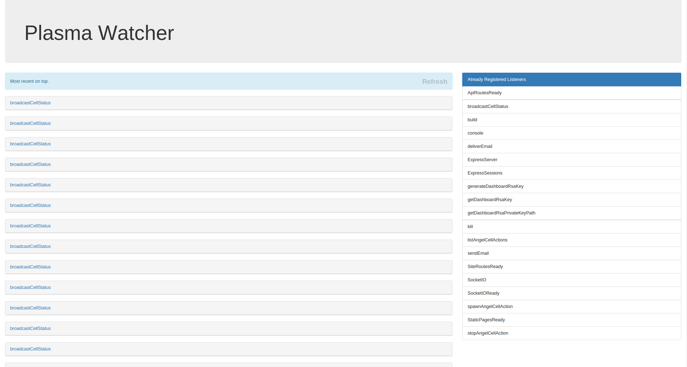

# Organic-plasmawatcher

Shows all emitted chemicals in the plasma and renders them in a pretty web page.

**Use only for development!!! This organelle shows all chemicals, emitted in the plasma and should not be used on production!!!**




## DNA

```js
"organic-plasmawatcher": {
  "source": "node_modules/organic-plasmawatcher",
  "unsubscribedTypes": ["console", "build"], // chemicals with these types wont be shown
  "port": "1335" // port for the express app
}
```

## TODO

* search field
* emit chemicals to the plasma
